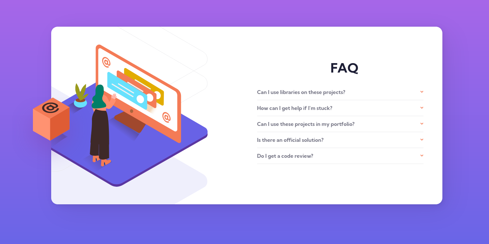

# Frontend Mentor - FAQ accordion card solution

This is a solution to the [FAQ accordion card challenge on Frontend Mentor](https://www.frontendmentor.io/challenges/faq-accordion-card-XlyjD0Oam). Frontend Mentor challenges help you improve your coding skills by building realistic projects.

## Table of contents

- [Overview](#overview)
  - [The challenge](#the-challenge)
  - [Screenshot](#screenshot)
  - [Links](#links)
- [My process](#my-process)
  - [Built with](#built-with)
  - [What I learned](#what-i-learned)
  - [Useful resources](#useful-resources)

## Overview

### The challenge

Users should be able to:

- View the optimal layout for the component depending on their device's screen size
- See hover states for all interactive elements on the page
- Hide/Show the answer to a question when the question is clicked

### Screenshot

### Links

- [Solution URL](https://github.com/kawsarahmed-012/faq-accordion-card)
- [Live Site URL](https://faq-accordion-card-kawsar.netlify.app)

## My process

### Built with

- Semantic HTML5 markup
- CSS custom properties
- Flexbox
- Mobile-first workflow
- [React](https://reactjs.org/) - JS library

### What I learned

It was really a big challange to make the website perfectly responsive. Aligning the images in desktop mode was tough. I learned how to mannual position images in responsive mode.

### Useful resources

- [MDN docs about background](https://developer.mozilla.org/en-US/docs/Web/CSS/background)
- [MDN docs about transform](https://developer.mozilla.org/en-US/docs/Web/CSS/transform)
